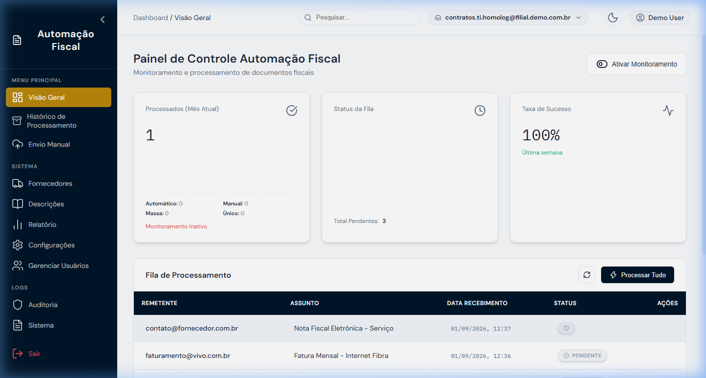

<div align="center">
  
# 📄 Automação Fiscal (Ambiente de Demonstração)


Este é o ambiente de demonstração *white-label* do sistema de **Automação Fiscal**. Ele simula a leitura, extração OCR e armazenamento de Notas Fiscais, sem expor dados reais da empresa ou depender de serviços complexos em background. Tudo ocorre em memória para facilitar apresentações e homologação de layouts.

</div>

<br>

<div align="center">
  
</div>

---

## ✨ Principais Funcionalidades (Simuladas)

- 📥 **Monitoramento de Caixa de Entrada**: Simula a busca de e-mails em caixas corporativas (ex. `compras`, `fiscal`).
- 🤖 **Extração Automática (OCR Fake)**: Demonstra o carregamento e extração de dados estruturados (CNPJ, Valor, Fornecedor) a partir de anexos PDF e XML.
- 🏢 **Gestão de Fornecedores**: Interface para visualizar lista de fornecedores cadastrados.
- ⚙️ **Workflow de Aprovação**: Ações simuladas de encaminhamento para o setor fiscal, aprovação de despesas e exclusão.

## 🚀 Como Executar Localmente

### 1. Pré-requisitos
- Python 3.9+ instalado
- Pip e virtualenv

### 2. Passo a Passo

```bash
# 1. Clone o repositório e acesse a pasta
git clone https://github.com/sua-organizacao/api-notas-demo.git
cd api-notas-demo

# 2. Crie um ambiente virtual (opcional, mas recomendado)
python -m venv venv

# No Windows:
venv\Scripts\activate
# No Linux/Mac:
source venv/bin/activate

# 3. Instale as dependências
pip install -r requirements.txt

# 4. Inicie o servidor FastAPI localmente
uvicorn main:app --reload --port 8080
```

> **Acesso:** Abra seu navegador em `http://localhost:8080` para visualizar a interface!

## 📂 Estrutura do Projeto

```bash
api-notas-demo/
├── main.py                # Arquivo principal com a API FastAPI e as rotas "Mock"
├── requirements.txt       # Dependências do projeto (fastapi, uvicorn, jinja2)
├── templates/             # HTMLs da interface do usuário (White-label)
│   ├── notas.html
│   ├── fornecedores.html
│   └── ...
└── static/                # Assets estáticos 
    ├── css/
    ├── js/
    └── images/
```

## 🔒 Aviso de Segurança e Privacidade

Este ambiente foi desenhado estritamente para **demonstração**. 
* **Não** conecte este repositório ao banco de dados em produção.
* As rotas de leitura de e-mail e processamento usam funções `asyncio.sleep()` para imitar tempo de rede/processamento, e os dados de `EXTRACTED_NFS` ficam salvos apenas em memória. 

---
<div align="center">
Desenvolvido com foco na melhor experiência de uso para times financeiros e fiscais.
</div>
