<div align="center">
  
# 📄 Automação Fiscal (Ambiente de Demonstração)


Este é o ambiente de demonstração *white-label* do sistema de **Automação Fiscal**. Ele simula a leitura, extração OCR e armazenamento de Notas Fiscais, sem expor dados reais da empresa ou depender de serviços complexos em background. Tudo ocorre em memória para facilitar apresentações e homologação de layouts.

</div>

<br>

<div align="center">
  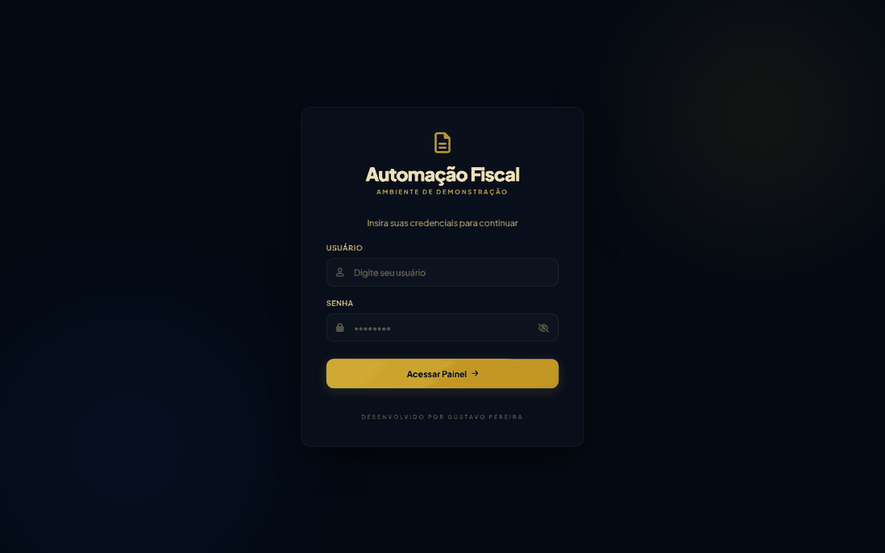
</div>

---

## ✨ Principais Funcionalidades (Simuladas)

- 📥 **Monitoramento de Caixa de Entrada**: Simula a busca de e-mails em caixas corporativas (ex. `compras`, `fiscal`).
- 🤖 **Extração Automática (OCR Fake)**: Demonstra o carregamento e extração de dados estruturados (CNPJ, Valor, Fornecedor) a partir de anexos PDF e XML.
- 📤 **Envio Manual**: Upload de PDF/XML com separação e roteamento por fornecedor.
- 🏢 **Gestão de Fornecedores**: Dicionário de chaves por unidade, com extração assistida a partir de um PDF.
- 📖 **Descrições e Normalizações**: Mapeia razões sociais divergentes para uma chave única e define a descrição padrão de cada fornecedor.
- 📊 **Relatório de Fornecedores**: Consolida quem envia Nota Fiscal e quem envia Boleto.
- 👥 **Controle de Acesso (RBAC)**: Administrador global e operadores restritos a uma caixa.
- 🛡️ **Auditoria e Logs**: Trilha das ações administrativas e log de execução do robô.
- ⚙️ **Workflow de Aprovação**: Ações simuladas de encaminhamento para o setor fiscal, aprovação de despesas e exclusão.

## 🖼️ Telas

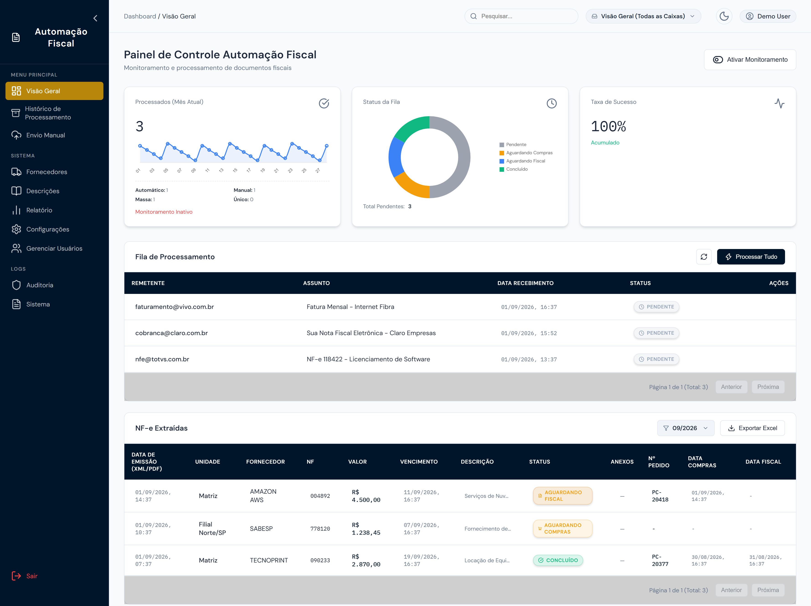

<sub><b>Visão Geral</b> — fila de processamento, indicadores do mês e NF-e extraídas.</sub>

As demais telas:

<details>
<summary><b>Login</b> — autenticação do ambiente de demonstração</summary>
<br>
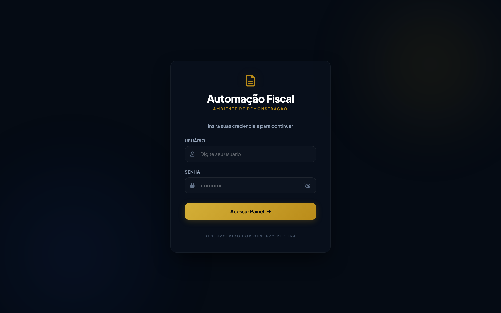
</details>

<details>
<summary><b>Histórico</b> — documentos concluídos e excluídos, com restauração</summary>
<br>
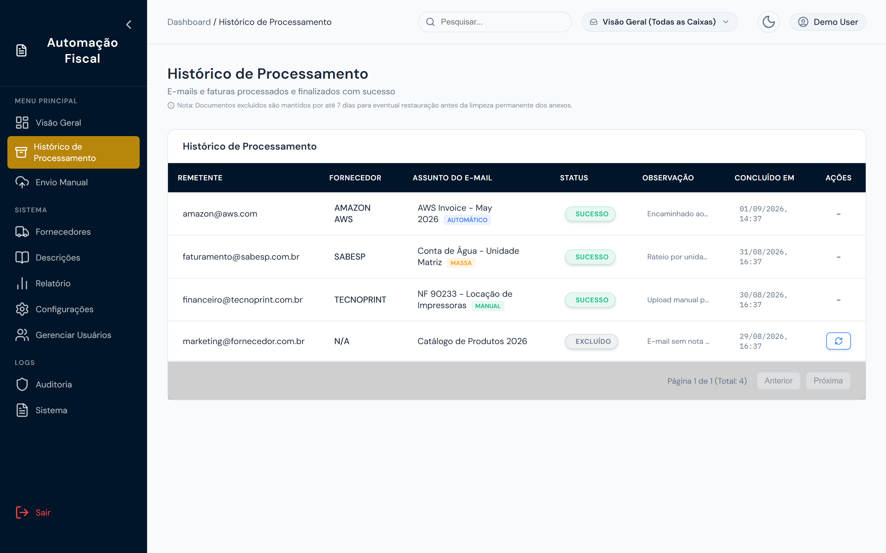
</details>

<details>
<summary><b>Envio Manual</b> — upload de PDF/XML e agrupamento por fornecedor</summary>
<br>
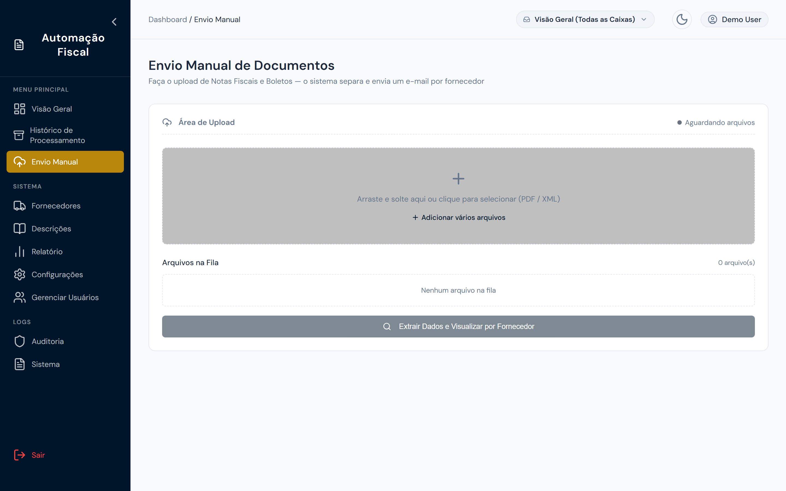
</details>

<details>
<summary><b>Fornecedores</b> — dicionário de chaves por unidade</summary>
<br>
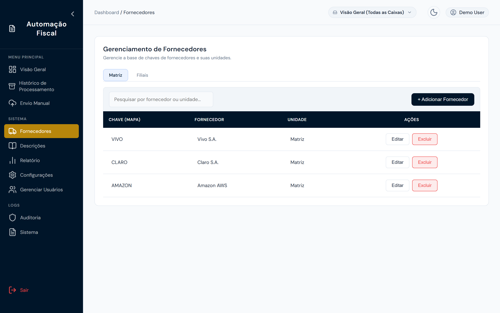
</details>

<details>
<summary><b>Descrições</b> — normalização de nomes e descrição padrão</summary>
<br>
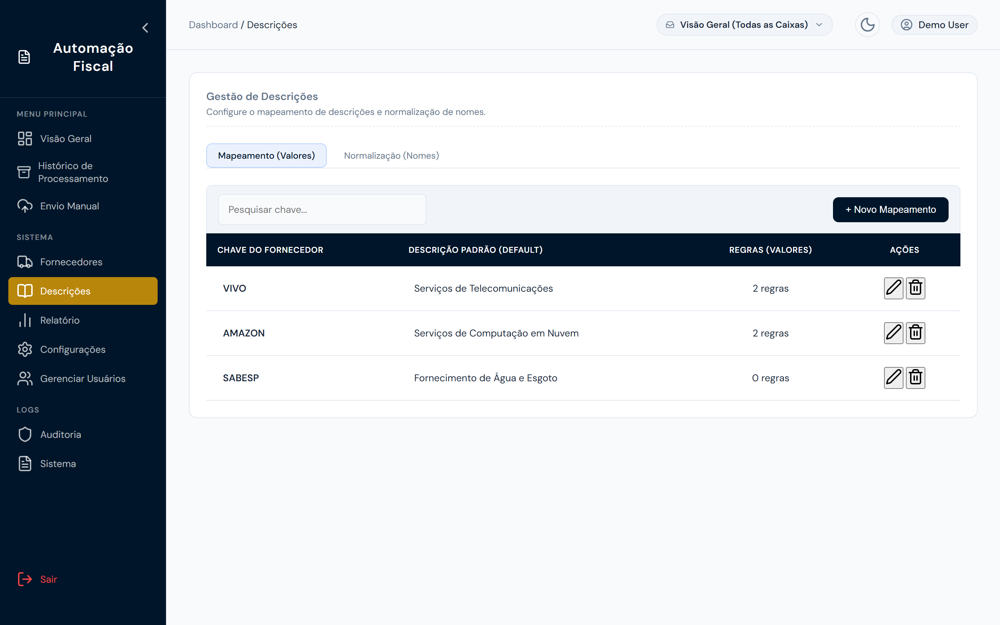
</details>

<details>
<summary><b>Relatório</b> — quem envia Nota Fiscal e quem envia Boleto</summary>
<br>
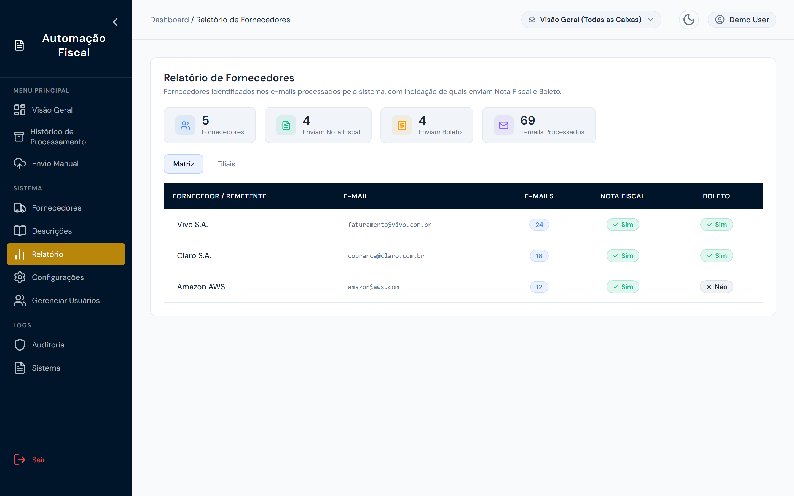
</details>

<details>
<summary><b>Configurações</b> — roteamento de notas e serviços do robô</summary>
<br>
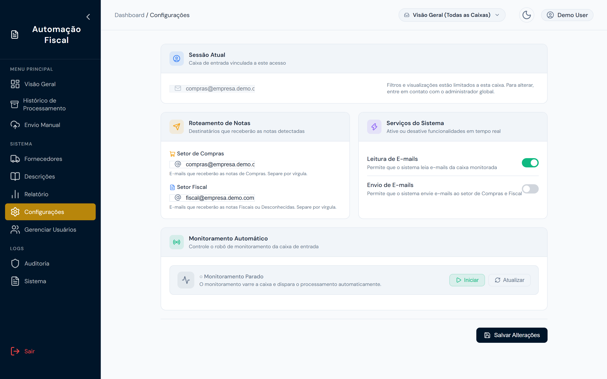
</details>

<details>
<summary><b>Usuários</b> — perfis e restrição por caixa (RBAC)</summary>
<br>
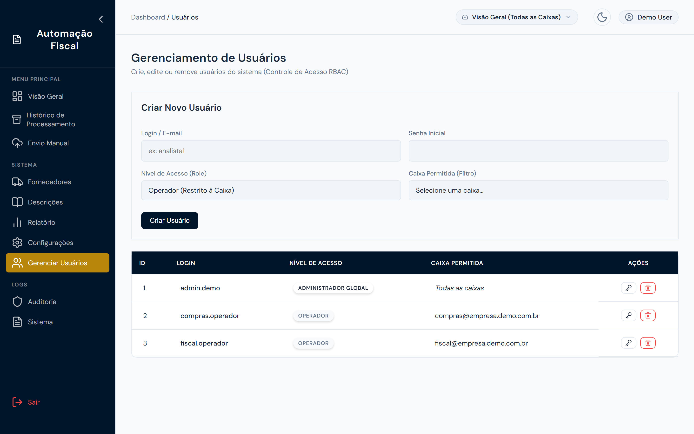
</details>

<details>
<summary><b>Auditoria</b> — trilha das ações administrativas</summary>
<br>
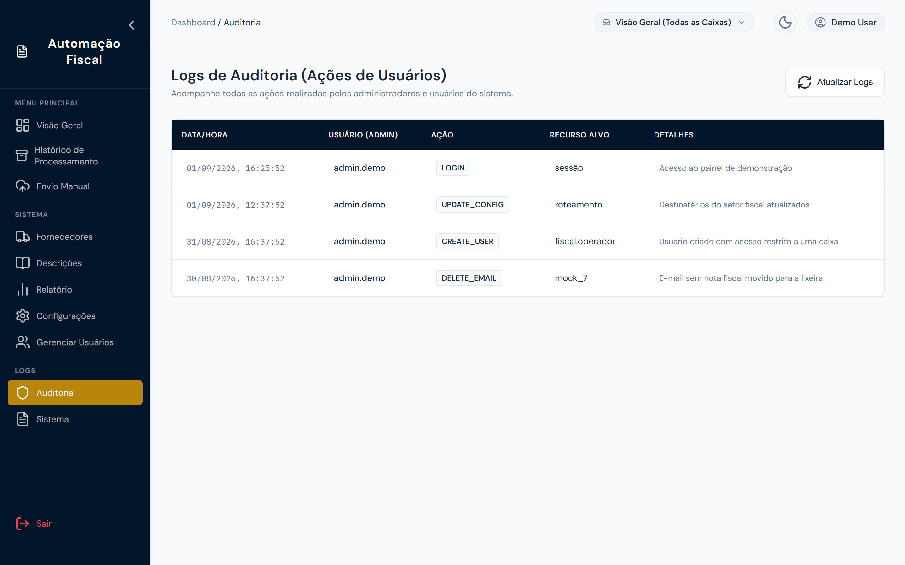
</details>

## 🚀 Como Executar Localmente

### 1. Pré-requisitos
- Python 3.9+ instalado
- Pip e virtualenv

### 2. Passo a Passo

```bash
# 1. Clone o repositório e acesse a pasta
git clone https://github.com/sua-organizacao/api-notas-demo.git
cd api-notas-demo

# 2. Crie um ambiente virtual (opcional, mas recomendado)
python -m venv venv

# No Windows:
venv\Scripts\activate
# No Linux/Mac:
source venv/bin/activate

# 3. Instale as dependências
pip install -r requirements.txt

# 4. Inicie o servidor FastAPI localmente
uvicorn main:app --reload --port 8080
```

> **Acesso:** Abra seu navegador em `http://localhost:8080` para visualizar a interface!

## 📂 Estrutura do Projeto

```bash
api-notas-demo/
├── main.py                # API FastAPI: rotas da interface + endpoints "Mock"
├── requirements.txt       # Dependências (fastapi, uvicorn, jinja2, python-multipart)
├── render.yaml            # Blueprint de deploy no Render
├── templates/             # HTMLs da interface do usuário (White-label)
│   ├── notas.html         # Visão geral / fila de processamento
│   ├── historico.html     # Histórico de documentos
│   ├── manual.html        # Envio manual
│   ├── fornecedores.html  # Dicionário de fornecedores
│   ├── descricoes.html    # Descrições e normalizações
│   ├── relatorio.html     # Relatório de fornecedores
│   ├── configuracoes.html # Parâmetros do sistema
│   ├── usuarios.html      # Controle de acesso
│   ├── auditoria.html     # Trilha de auditoria
│   └── logs.html          # Log do robô
├── static/                # Assets estáticos
│   ├── css/
│   ├── js/
│   └── images/
└── docs/capturas/         # Capturas de tela usadas neste README
```

## 🔒 Aviso de Segurança e Privacidade

Este ambiente foi desenhado estritamente para **demonstração**. 
* **Não** conecte este repositório ao banco de dados em produção.
* As rotas de leitura de e-mail e processamento usam funções `asyncio.sleep()` para imitar tempo de rede/processamento, e os dados de `EXTRACTED_NFS` ficam salvos apenas em memória. 

---
<div align="center">
Desenvolvido com foco na melhor experiência de uso para times financeiros e fiscais.
</div>
